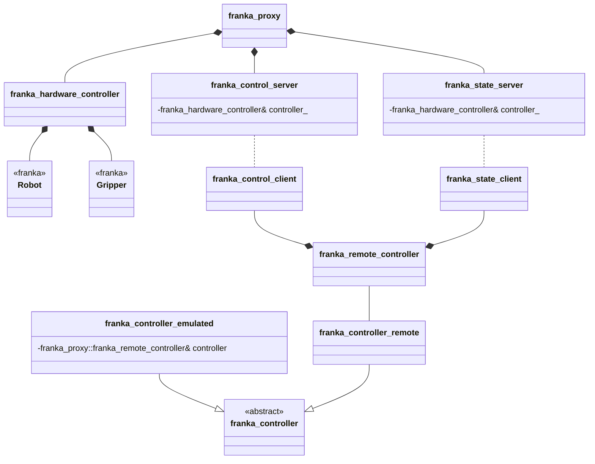

# Setup

## Using the Project

This project consists of two components:

- A client/controller library for integration into your own project.
- A server application that runs on the computer connected to the Franka Emika robot.

Both components are typically installed via [`vcpkg`](https://github.com/microsoft/vcpkg) (last tested version: master at date 2025-12-05). You can either use the provided overlay ports in `./tools/vcpkg-overlay-ports/` or, if available to you, the internal AI3 `vcpkg` fork:
https://resy-gitlab.inf.uni-bayreuth.de/tools/vcpkg.git

### Installation

- To install the client library:
  ```vcpkg install franka-proxy --overlay-ports=<insert/path/here>/franka-proxy/tools/vcpkg-overlay-ports```

- To install the server and test applications:
  ```vcpkg install franka-proxy[server,tests] --overlay-ports=<insert/path/here>/franka-proxy/tools/vcpkg-overlay-ports```

Note: Ensure that the client and server use the same port version. Compatibility is not guaranteed otherwise.

### Executables and Tests

After installation with the `[server,tests]` features, the executables can be found in:
```
vcpkg\installed\x64-windows\tools\franka-proxy
```

**Available executables:**

- **`franka_proxy.exe`** - Main proxy server application (must run for franka_proxy_client_test)
- **`franka_proxy_client_test.exe`** - Client tests with subcommands:
  - `force` - Force control test
  - `gripper` - Gripper control test
  - `guiding` - Guiding mode test
  - `playback` - Playback test
  - `ple` - PLE test
  - `ptp` - Point-to-point motion test
  - `vacuum` - Vacuum gripper test

Use `-h` or `--help` with any executable to see detailed usage information.

## Compatibility

The proxy server currently targets:
- **libfranka**: 0.9.2
- **Franka Emika robot firmware**: 4.2.2

### Checking Compatibility and Updating libfranka

#### 1. Check Your Robot System Version
To find out your robot's system version:
- Open the Franka Desk web interface (typically at `https://<robot-ip>`)
- Navigate to **Settings** → **System**
- Note the **System version** (e.g., 4.2.2, 5.0.0, etc.)

#### 2. Find Compatible libfranka Version
Use the [Franka Compatibility Matrix](https://frankarobotics.github.io/docs/compatibility.html) to determine which libfranka version is compatible with your robot's system version.

#### 3. Update the Proxy for Different libfranka Versions
The libfranka version is configured in the vcpkg overlay ports. To update it:

**Step 1:** Edit `tools/vcpkg-overlay-ports/franka/vcpkg.json`:
- Update the `version-string` field (line 3) to your desired libfranka version
- Example: `"version-string": "0.10.0"`

**Step 2:** Edit `tools/vcpkg-overlay-ports/franka/portfile.cmake`:
- Find the appropriate git commit hash for your target libfranka version from the [libfranka releases](https://github.com/frankaemika/libfranka/releases)
- Update the `REF` field (line 48) with the new commit hash
- Update the `SHA512` field (line 49) accordingly (you may need to run vcpkg once to get the correct hash, or leave it empty initially and vcpkg will provide the correct value)

**Step 3:** Reinstall the franka-proxy package:
```bash
vcpkg remove franka franka-proxy
vcpkg install franka-proxy[server,tests] --overlay-ports=<path>/franka-proxy/tools/vcpkg-overlay-ports
```

**Note:** After updating libfranka, ensure you test thoroughly with your specific robot firmware version to verify compatibility.

---

# Building from Source

## Installing Dependencies via vcpkg

Use `vcpkg`:
```
./bootstrap-vcpkg.sh
vcpkg install asio argparse eigen3 franka nlohmann-json poco
```

## Using CMakePresets

If you plan to use CMakePresets, copy `./tools/CMakePresets.json` to the project root directory (next to `CMakeLists.txt`). Modify the `common-config` to specify the correct `CMAKE_TOOLCHAIN_FILE` and compiler. Then build:
```
cmake --preset windows-release
cmake --build ./out/build/windows-release --config windows-release
```

## Manual Build

To build without presets:
```
mkdir build
cd build
cmake .. "-DCMAKE_TOOLCHAIN_FILE=<insert/path/here>/vcpkg/scripts/buildsystems/vcpkg.cmake"
cmake --build .
```

---

## Python Bindings

To generate Python bindings, the loose steps are:

1. Install `pybind11` via `vcpkg`.
2. Enable `BUILD_PYTHON_CONTROLLER` option in CMake chache and reconfigure the project.
3. Build the project in `Release` mode.
4. Run `controller_test.py` located in `<build_dir>/python`.

---

## Project structure

