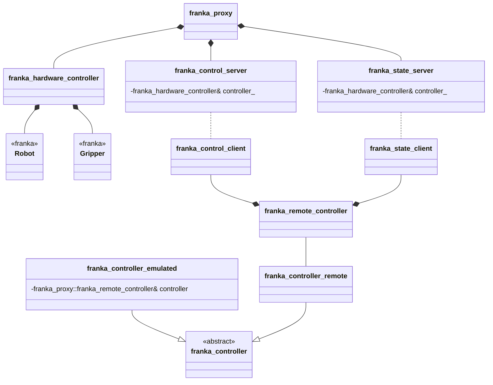

# Setup

## Using the Project

This project consists of two components:

- A client/controller library for integration into your own project.
- A server application that runs on the computer connected to the Franka Emika robot.

Both components are typically installed via `vcpkg`. You can either use the provided overlay ports in `./tools/vcpkg-overlay-ports/` or, if available to you, the internal AI3 `vcpkg` fork:
https://resy-gitlab.inf.uni-bayreuth.de/tools/vcpkg.git

### Installation

- To install the client library:
  ```vcpkg install franka-proxy --overlay-ports=<insert/path/here>/franka_proxy/tools/vcpkg-overlay-ports```

- To install the server and test applications:
  ```vcpkg install franka-proxy[server,tests] --overlay-ports=<insert/path/here>/franka_proxy/tools/vcpkg-overlay-ports```

Note: Ensure that the client and server use the same port version. Compatibility is not guaranteed otherwise.

---

# Building from Source

## Installing Dependencies via vcpkg

Use `vcpkg`:
```
./bootstrap-vcpkg.sh
vcpkg install asio argparse eigen3 franka nlohmann-json poco
```

## Using CMakePresets

If you plan to use CMakePresets, copy `./tools/CMakePresets.json` to the project root directory (next to `CMakeLists.txt`). Modify the `common-config` to specify the correct `CMAKE_TOOLCHAIN_FILE` and compiler. Then build:
```
cmake --preset windows-release
cmake --build ./out/build/windows-release --config windows-release
```

## Manual Build

To build without presets:
```
mkdir build
cd build
cmake .. "-DCMAKE_TOOLCHAIN_FILE=<insert/path/here>/vcpkg/scripts/buildsystems/vcpkg.cmake"
cmake --build .
```

---

## Python Bindings

To generate Python bindings, the loose steps are:

1. Install `pybind11` via `vcpkg`.
2. Enable `BUILD_PYTHON_CONTROLLER` option in CMake chache and reconfigure the project.
3. Build the project in `Release` mode.
4. Run `controller_test.py` located in `<build_dir>/python`.

---

## Project structure

