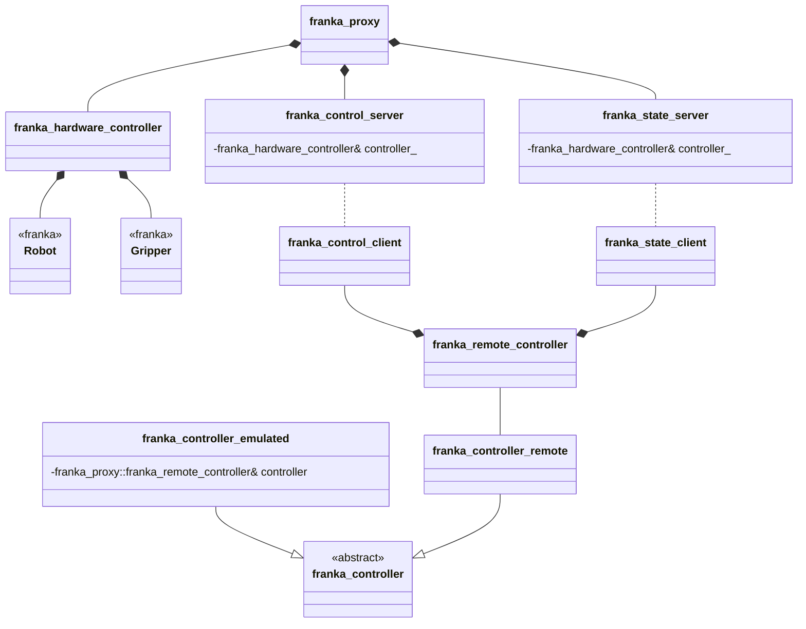

# Setup
## Externals via vcpkg

./bootstrap-vcpkg.bat

vcpkg install asio:x64-windows franka:x64-windows

mkdir build
cd build
cmake .. "-DCMAKE_TOOLCHAIN_FILE=C:\Users\hartwig\Desktop\franka_proxy_without_viral\tools\vcpkg\scripts\buildsystems\vcpkg.cmake"
cmake --build .

# Project structure
