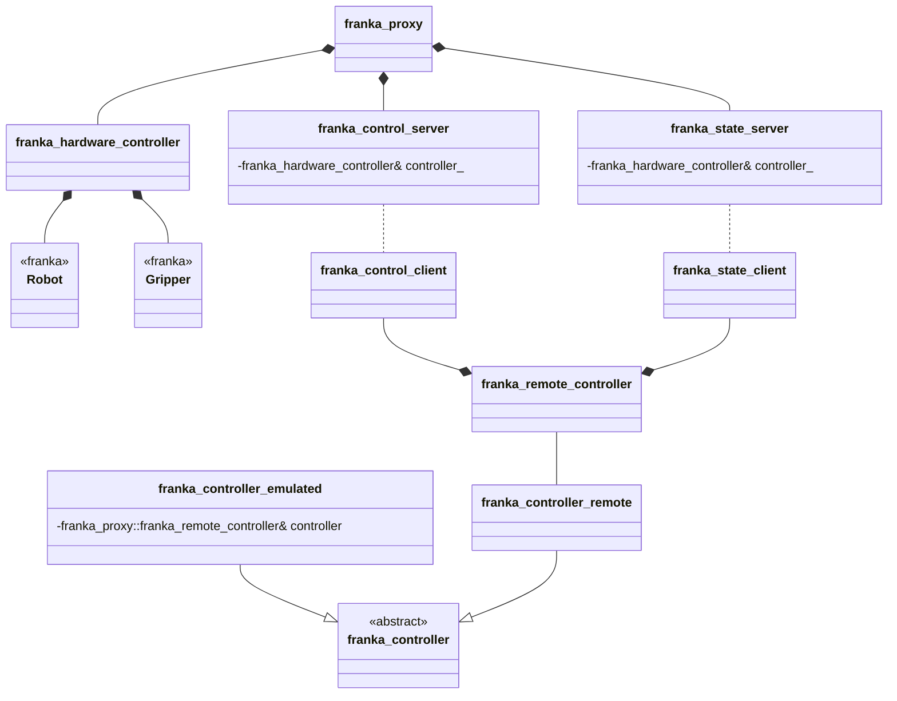

# Setup
## Using the project
This project is split into two parts. A client library for inclusion into your own project and a server application, that runs directly on the computer connected to the Franka Emika robot. Normally you install both of these via vcpkg. Use the AI3 vcpkg for this: https://resy-gitlab.inf.uni-bayreuth.de/tools/vcpkg.git

To install the client library use:  
```./vcpkg.exe install franka-proxy:x64-windows ```

And to install the server application use:  
```./vcpkg.exe install franka-proxy[server]:x64-windows```

Server and client are only compatible if you use the same port, so make sure to work on an identical version of vcpkg (ai3 internal version).


# Building from Source 
## Externals via vcpkg 

Use the AI3 vcpkg for this: https://resy-gitlab.inf.uni-bayreuth.de/tools/vcpkg.git

```sh
./bootstrap-vcpkg.bat

vcpkg install --triplet=x64-windows asio argparse franka nlohmann-json
```

Build everything from source:
```
mkdir build
cd build
cmake .. "-DCMAKE_TOOLCHAIN_FILE=C:/insert/path/here/tools/vcpkg/scripts/buildsystems/vcpkg.cmake"
cmake --build .
```

If building using the CMakePresets make sure to change the common-config to point your CMAKE_TOOLCHAIN_FILE of vcpkg (default points to the vcpkg in ./tools/vcpkg).


## Project structure

